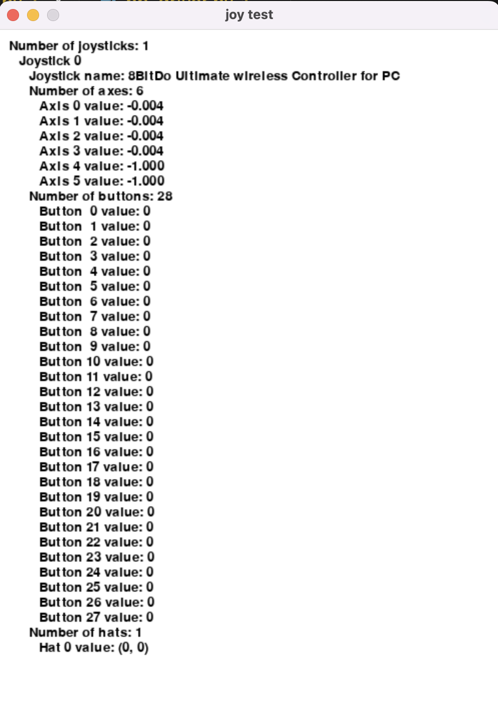
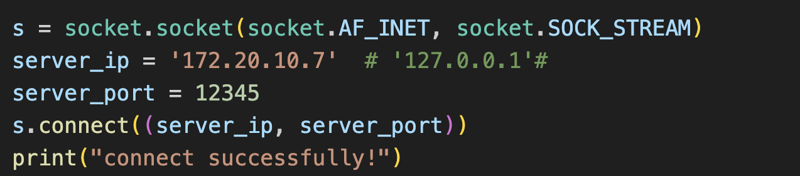
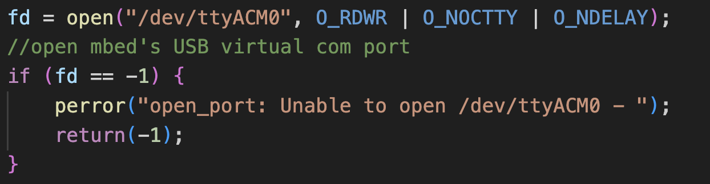

# 4180_Final_Project
**Team members:** Andrew Gunawan, Bo Pang, Tianle Li
## Project Overview
### Short Summary
For this project, we built an RC surveillance vehicle. The vehicle has a rotating camera and two wheels driven by their own motors. The user can use Xbox Controller to control the speed of each wheel and rotate the camera so it can capture visual data from different angles. The vehicle can transmit real-time videos feed to a network. It also has a braking system and a speaker so that it can stop when detecting obstacles and set alarm.
### Demo Video
## Hardware Platform
## Software Platform

**Controller signals to Pi:**

the **Xbox** establishes a connection to the user's laptop via a 2.4G connection. The user utilizes a driver to acquire button information from the Xbox, where the values of **two joysticks** range from -1 to 1, and **two buttons** have binary states (pressed: 1, not pressed: 0). The driver processes the obtained Xbox information, logically interpreting user actions. The button values are then converted into a string and transmitted via TCP to the Raspberry Pi. The user sends data to the Pi at a rate of 30 transmissions per second.

**Pi to MBED**:

The C++ server on the Raspberry Pi receives string data sent by the user via TCP. It parses the numerical values from the received string data. As MBED can only handle data of type `char`, the Raspberry Pi encodes the float values, such as -1 to -1, within the range of signed char (-128 to 127). These encoded values are then transmitted to the MBED via a serial port. The MBED receives the signed char data, decodes it, and controls the motor and servo based on the decoded information.

**Video Part:**

The Raspberry Pi captures video data from the camera and broadcasts the video stream online. Users can access a URL to view real-time video data.

### Software Block Diagram

## Setting up the software environment

Clone this repository using command: `git clone https://github.com/AJG07/RC_Surveillance_Vehicle.git`

### User: 

* Make sure you have **Python** installed on your computer. 

* Install pygame library use `pip install pygame`.

* Connect your Xbox controller to the computer. You can run the `general_driver.py` code to test if your controller is recognized. If the following interface appears, it means the setup is successful.

Run the code using: `python ./general_driver.py`

Set up the Raspberry Pi environment, connect the **user's computer** and the **Raspberry Pi** on the same network. Change the `server_ip` in the `pb_driver.py` to the IP address of the Pi.

Run the server code on the Raspberry Pi.

On the user's computer, execute the command: `python ./pb_driver.py`.

If there are no error messages, it indicates that the Raspberry Pi has successfully received the sent string, confirming the successful transmission of signals from the Xbox.

### Raspberry Pi:

Server are performed within the Raspberry Pi. You can interact with the Pi using peripherals directly connected to it or utilize remote access methods like VNC Viewer. Ensure that the Raspbian OS is installed on your Pi by following the specific instructions available on the Raspberry Pi website.

Ensure that the Pi and the user's laptop are on the same network. We have provided a **makefile** for the code. You can navigate to the folder and execute the `make` command directly to generate the required executable files. (Note: You need to modify the `server_ip` to the current IP address of the Raspberry Pi.)

This code requires a wired connection between the Raspberry Pi and the MBED. Otherwise, an error will occur.

So, first, run the `RobotController.cpp` program on the Pi. Then, run the `pb_driver.py` program on the user's side. The Pi will receive data sent by the user and transmit the data to the MBED through the serial port.

## Limitations / Possible Improvements

