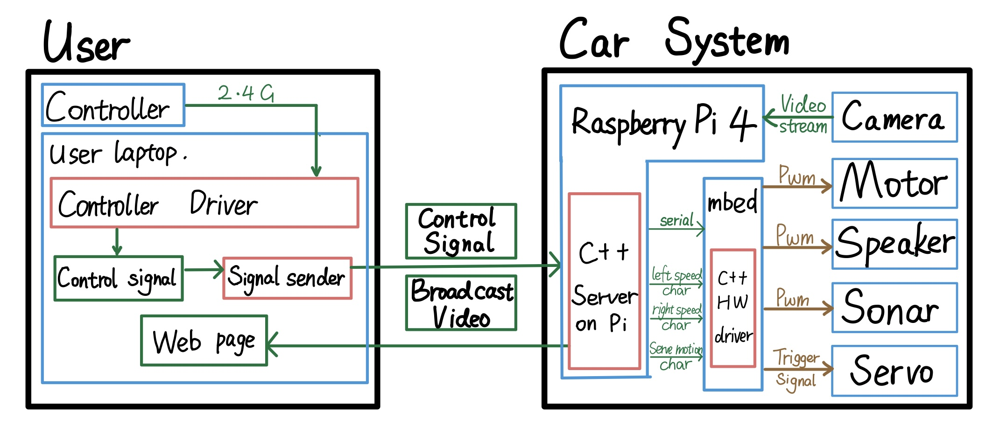
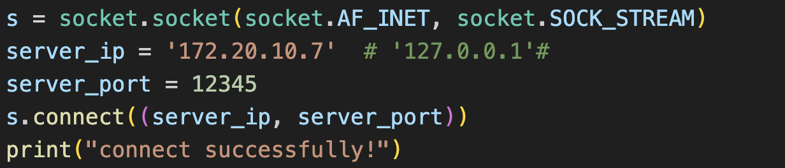

# RC Surveillance Vehicle
**Team members:** Andrew Gunawan, Bo Pang, Tianle Li

## Project Overview
### Summary
For this project, we built an RC surveillance vehicle. The vehicle has a rotating camera and two wheels driven by their own motors. The user can use Xbox Controller to control the speed of each wheel and rotate the camera so it can capture visual data from different angles. The vehicle can transmit real-time videos feed to a network. It also has a braking system and a speaker so that it can stop when detecting obstacles and set alarm.

### Demo Video
A short demo of this project can be seen on [youtube](https://youtu.be/EQbsywy5lTs).

### Robot with Controller


### Controller Interface with Web Live Stream


## Hardware Platform

### Parts List
* Raspberry Pi 4 Model B
* Mbed LPC 1768
* DEPSTECH DW50 Webcam
* 2x DAGU DG01D geared DC motors
* SparkFun TB6612FNG dual H-Bridge
* SparkFun shadow chassis
* 2N3904 transistor
* SparkFun 8ohm 0.1W PCB speaker
* SparkFun HC-SR04 Sonar
* 8BitDo Ultimate C 2.4G Wireless Controller
* USB-C power bank
* 4x AA battery pack

### Hardware Block Diagram


### Hardware Schematic

## Software Platform

### Software Block Diagram




### Handheld Controller to Pi

the **Xbox** establishes a connection to the user's laptop via a 2.4G connection. The user utilizes a driver to acquire button information from the Xbox, where the values of **two joysticks** range from -1 to 1, and **two buttons** have binary states (pressed: 1, not pressed: 0). The driver processes the obtained Xbox information, logically interpreting user actions. The button values are then converted into a string and transmitted via TCP to the Raspberry Pi. The user sends data to the Pi at a rate of 30 transmissions per second.

### Pi to Mbed

The C++ server on the Raspberry Pi receives string data sent by the user via TCP. It parses the numerical values from the received string data. As MBED can only handle data of type `char`, the Raspberry Pi encodes the float values, such as -1 to -1, within the range of signed char (-128 to 127). These encoded values are then transmitted to the MBED via a serial port. The MBED receives the signed char data, decodes it, and controls the motor and servo based on the decoded information.

### Video Streaming

The Raspberry Pi captures video data from the camera and broadcasts the video stream online. Users can access a URL to view real-time video data.

### Mbed to IO
The Mbed code uses RTOS with threads and the Mbed I/O APIs to realize the functions of the robot. 

In the first thread, Mbed communicates with the Pi and keeps getting three characters from Pi every 0.03 seconds. It parses the three signed characters into 2 floats (left motor speed and right motor speed) and 1 integer (1 indicates the camera should rotate right, -1  indicates camera rotate left and 0 indicates the camera should do nothing). 

The second thread uses a sonar to get distance every 0.2 seconds. 

The third thread checks if the distance is too close (less than 15 cm) every 0.2 seconds and makes the speaker alert if so. 

The fourth thread updates the position of the Servo motor every 0.2 seconds. The main function sets the speaker frequency to 500hz.

## Setting up the software environment

Clone this repository using command: `git clone https://github.com/AJG07/RC_Surveillance_Vehicle.git`

### User Laptop: 

* Make sure you have **Python** installed on your computer. 

* Install pygame library use `pip install pygame`.

* Connect your Xbox controller to the computer. You can run the `general_driver.py` code to test if your controller is recognized. If the following interface appears, it means the setup is successful.

Run the code using: `python ./general_driver.py`


Set up the Raspberry Pi environment, connect the **user's computer** and the **Raspberry Pi** on the same network. Change the `server_ip` in the `pb_driver.py` to the IP address of the Pi.

Run the server code on the Raspberry Pi.

On the user's computer, execute the command: `python ./pb_driver.py`.


If there are no error messages, it indicates that the Raspberry Pi has successfully received the sent string, confirming the successful transmission of signals from the Xbox.

### Raspberry Pi:

For the easiest setup, it is a good idea to use VNC to access the Pi. Additionally, setting up the Pi to automatically connect to the same network with a static IP address will make things more streamlined down the line. These two guides can help setting that up. 

[Raspberry Pi Set Static IP](https://www.makeuseof.com/raspberry-pi-set-static-ip/)

[Raspberry Pi Set Network Priority](https://raspberrypi.stackexchange.com/questions/58304/how-to-set-wifi-network-priority)

Server are performed within the Raspberry Pi. You can interact with the Pi using peripherals directly connected to it or utilize remote access methods like VNC Viewer. Ensure that the Raspbian OS is installed on your Pi by following the specific instructions available on the Raspberry Pi website.

Ensure that the Pi and the user's laptop are on the same network. We have provided a **makefile** for the code. You can navigate to the folder and execute the `make` command directly to generate the required executable files. (Note: You need to modify the `server_ip` to the current IP address of the Raspberry Pi.)



This code requires a wired connection between the Raspberry Pi and the MBED. Otherwise, an error will occur.


So, first, run the `RobotController.cpp` program on the Pi. Then, run the `pb_driver.py` program on the user's side. The Pi will receive data sent by the user and transmit the data to the MBED through the serial port.

To enable the camera live stream from the Pi, we took advantage of the motion library. To get started, just install motion on the Pi using the following command:

`sudo apt install motion`

Once that is finished, there are some changes to the configuration that need to be made. Open the configuration file using the following command:

`sudo nano /etc/motion/motion.conf`

Within this file, change the following parameters:
```
daemon on
stream_localhost off
picture_output off
movie_output off
stream_maxrate 100 # not currently in file, needs to be added for smoother video
framerate 100
width 640
height 480
```

Running the program is as simple as executing the following command:

`sudo motion`

Anyone on the same network should be able to see the feed at 192.20.10.7:8081, replacing the IP address with the Pi’s address and the port to whatever was specified in the above configuration file (default 8081).

### Mbed:

Software installation on the Mbed should be quite simple. Import the code under the [Mbed_Code](Mbed_Code) folder into Keil Studio cloud. The code should include the necessary libraries (RTOS, Motor, Servo). All that needs to be done is to build the code and download it to the Mbed. 


## Limitations / Possible Improvements
One of the major limitations is the use of both an Mbed and a Raspberry Pi. In the future, this project should be able to achieve the same functionality using only the Pi, which would greatly reduce complexity and likely improve performance. 

Additionally, the entire robot should be able to be powered off of one more powerful battery pack as opposed to having two separate battery packs. The current motors are also not getting enough power to drive around with the heavy USB-C battery pack that is  being used, so it would be beneficial to replace the battery pack with a lighter version.

Lastly, it would be nice to combine the controller interface with the web streaming service. Currently, having them as two separate interfaces makes it less intuitive for the user, so combining them would create an overall more seamless experience.